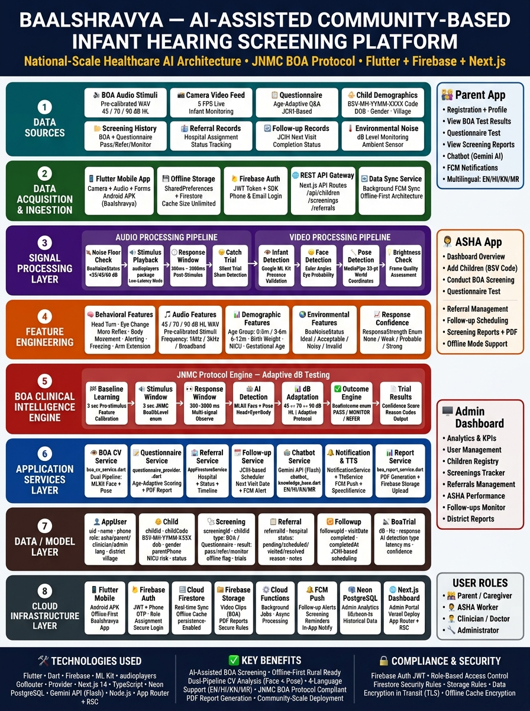

<h1 align="center">
  
</h1>

<p align="center">
  <strong>बालश्रव्या</strong> — "Child's Voice" in Sanskrit
</p>

<p align="center">
  A comprehensive early infant hearing detection system built for Indian healthcare contexts.
</p>

<p align="center">
  
  
  
  
  
</p>

---

## 📖 Overview

**Baalshravya** is a mobile application designed for early detection of hearing loss in infants. It supports two clinical screening methods:

- 🧪 **BOA (Behavioral Observation Audiometry)** — Camera + ML-based adaptive hearing test
- 📋 **Questionnaire Screening** — Risk factor assessment via caregiver interview

The app serves three user roles — **Parents**, **ASHA Workers**, and **Clinicians** — and generates clinical PDF reports for follow-up care.

---

## 🏗️ Architecture



The project follows a **V2 modular architecture** with Firebase backend:

```
📦 Baalshravya
 ┣ 🔐 Authentication      (Phone OTP + Google Sign-In)
 ┣ 👶 Baby Management     (Infant registration & tracking)
 ┣ 📋 Questionnaire       (Risk factor scoring)
 ┣ 🎧 BOA Test            (Adaptive audiometry with MLKit CV)
 ┣ 🏥 ASHA Worker Module  (Field operations dashboard)
 ┣ 👨‍👩‍👧 Parent Module      (Profile & report access)
 ┣ 📊 Reports             (PDF generation — Parent & Clinical)
 ┗ 🌐 Localization        (EN / HI / KN / MR)
```

---

## ✨ Key Features

### 🎧 BOA Test (Behavioral Observation Audiometry)
- JNMC-specified adaptive dB protocol: **70 → 45 / 90 dB HL**
- Frequencies: 1 kHz, 3 kHz, Broadband Noise, Warble Tone
- **Dual-pipeline Computer Vision:**
  - 🔵 **Pipeline A:** Google MLKit Face Detector (eye probability, head pose)
  - 🟢 **Pipeline B:** Google MLKit Pose Detector (33-point skeleton, Moro reflex detection)
- Age-adaptive weighting (0–3m, 3–6m, 6–12m)
- Silent catch trials to reduce false positives
- Outcomes: ✅ Favorable Hearing / ⚠️ Monitor / 🔴 Suspected Hearing Loss

### 📋 Questionnaire Screening
- Age-banded questions adaptive to infant's age (0–12 months)
- 5 scored sections across 31 questions
- Scoring: Yes=1, Partial=0.5, No=0
- Results: **PASS** (<30%) / **MONITOR** (30–60%) / **REFER** (>60%)

### 📄 PDF Report Generation
| Report Type | Contents |
|-------------|----------|
| **BOA Report** | Outcome card, trial table, CV explanations, recommendations |
| **Questionnaire Report** | Section scores, risk %, response details, follow-up actions |
| **Variants** | Parent version + Clinical version |

### 🌐 Multilingual Support
| Language | Code |
|----------|------|
| English  | `en` |
| Hindi    | `hi` |
| Kannada  | `kn` |
| Marathi  | `mr` |

---

## 🧩 Module Overview

| Module | Description | Screens |
|--------|-------------|---------|
| **Auth** | OTP login, role selection, Google Sign-In | 7 |
| **Baby Management** | Infant registration, profile | 2 |
| **Questionnaire** | Risk assessment, scoring, result | 3 |
| **BOA Test** | Intro, wizard, test, checklist, result | 5 |
| **ASHA Worker** | Dashboard, village, batch registration | 5 |
| **Parent** | Profile, info, report access | 3 |
| **History** | Screening history with report access | 1 |
| **Medical Insights** | Hearing milestones, risk education | 1 |

---

## 🛠️ Tech Stack

| Category | Technology |
|----------|-----------|
| **Framework** | Flutter 3.x / Dart |
| **Backend** | Firebase (Auth, Firestore, Storage) |
| **State Management** | Provider (ChangeNotifier) |
| **Navigation** | GoRouter v13 |
| **Computer Vision** | Google MLKit (Face + Pose Detection) |
| **Audio** | audioplayers (clinical-grade WAV playback) |
| **PDF** | pdf + printing packages |
| **Video** | video_compress (<5 MB target) |
| **TTS/STT** | flutter_tts + speech_to_text |
| **Animations** | flutter_animate + Lottie |

---

## 📁 Project Structure

```
Infant_hearing/
├── infant_hearing_app/          # Main Flutter application
│   ├── lib/
│   │   ├── core/                # Theme, constants, localization, utils
│   │   ├── data/                # Firebase services, models
│   │   └── features/            # Feature modules (auth, boa, asha, etc.)
│   └── assets/
│       └── audio/               # Clinical WAV stimuli (45/70/90 dB)
├── admin_dashboard/             # Admin web dashboard
├── migration_scripts/           # Firestore migration scripts
├── firestore.rules              # Firestore security rules
├── storage.rules                # Firebase Storage rules
└── firestore.indexes.json       # Database indexes
```

---

## 🚀 Getting Started

### Prerequisites
- Flutter SDK 3.x+
- Firebase project with Auth, Firestore, Storage enabled
- Android Studio / VS Code

### Setup

```bash
# 1. Clone the repository
git clone https://github.com/jalawadiakshay-gif/Infant-hearing.git
cd Infant-hearing/infant_hearing_app

# 2. Install dependencies
flutter pub get

# 3. Add Firebase config (google-services.json / GoogleService-Info.plist)
#    Place in android/app/ and ios/Runner/ respectively

# 4. Run the app
flutter run
```

> ⚠️ **Note:** `serviceAccountKey.json` and `google-services.json` are excluded from this repo for security. Contact the project admin for access.

---

## 📊 Project Statistics

| Metric | Value |
|--------|-------|
| Lines of Code | ~15,000+ |
| Feature Modules | 5 major |
| Total Screens | ~40 |
| Supported Languages | 4 |
| Report Types | 2 (Parent + Clinical) |
| Audio Stimuli | 3 (45 / 70 / 90 dB WAV) |

---

## 🔮 Roadmap

- [ ] Speech-to-Text auditory response verification
- [ ] ABR/ASSR test integration
- [ ] Telehealth video consultation
- [ ] Cloud Functions for server-side scoring
- [ ] SMS/WhatsApp report delivery
- [ ] Google Health export format
- [ ] Advanced analytics dashboard for program monitoring

---

## 👥 Contributors

<a href="https://github.com/jalawadiakshay-gif">
  
</a>
<a href="https://github.com/Abhinav-Angadi">
  
</a>

---

## 📜 License

This project is currently **private**. All rights reserved © 2024 Baalshravya Team.

---

<p align="center">
  Made with ❤️ for early hearing care in India
</p>
